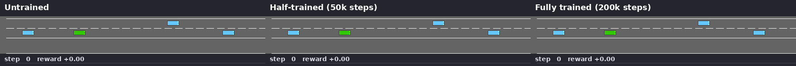
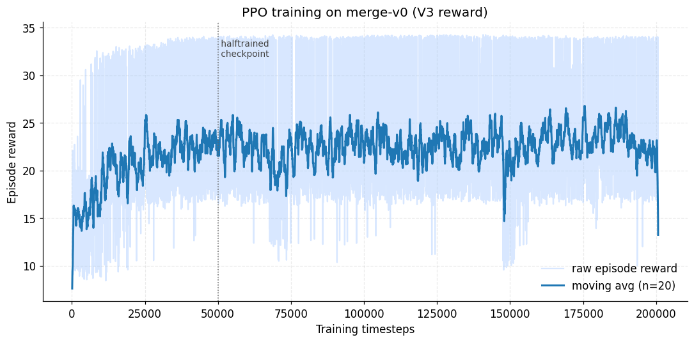
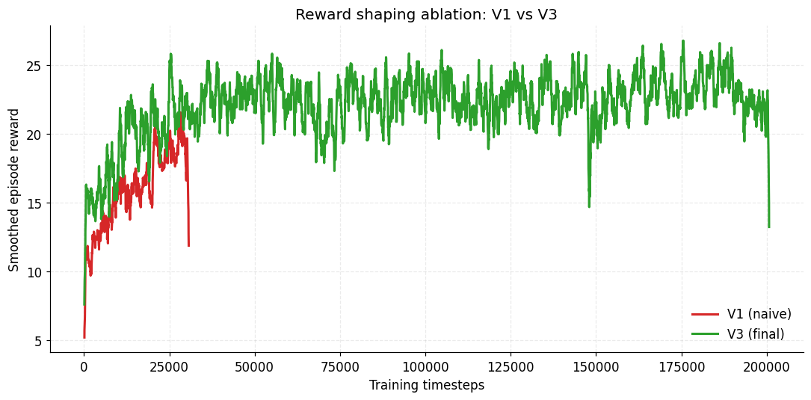
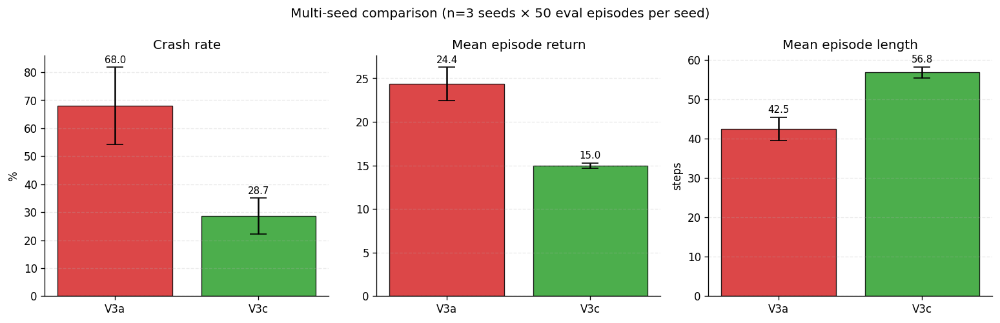
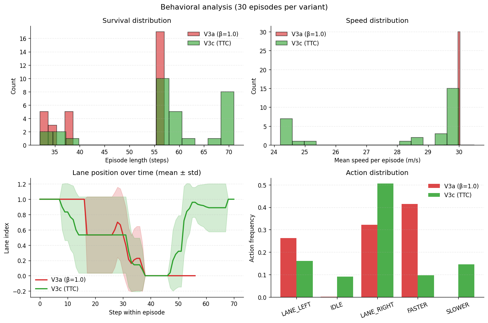

<div align="center">

# Merge-RL: Iterative Reward Design for Autonomous Merging

**A study in reward shaping and multi-seed evaluation on `highway-env/merge-v0`**

[](https://github.com/HBer1l/highway-rl/actions/workflows/ci.yml)
[](https://www.python.org/)
[](https://pytorch.org/)
[](https://stable-baselines3.readthedocs.io/)
[](LICENSE)

> **Course:** CMP4501 - Applied Reinforcement Learning
> **Track:** Option A · Autonomous Driving with Highway-Env
> **Author:** Hatice Beril Satıcı · 2201844

</div>

## Training Evolution

<p align="center">
 
</p>

<p align="center"><em>Same starting seeds, three checkpoints. Left: random policy crashes immediately. Center: 50k steps, the agent has learned to slow on the merge ramp but still mistimes the merge. Right: 200k steps with the V3c reward, the agent yields, finds a gap, and merges cleanly.</em></p>

## TL;DR

A PPO agent was trained on `highway-env/merge-v0` under four reward formulations. The headline finding: **a time-to-collision (TTC) based dense safety reward (V3c) reduces crash rate from 68.0% ± 13.9% to 28.7% ± 6.4% relative to a sparse collision-only reward (V3a)** - a 58% relative reduction (Welch's t-test, p = 0.024, n = 3 seeds × 50 evaluation episodes). Single-seed evaluation initially overstated the V3a baseline as 42% crash rate; multi-seed evaluation revealed the true baseline is much worse, and the original numbers came from a lucky training initialization.

## Table of Contents

- [Quickstart](#-quickstart)
- [Project Structure](#-project-structure)
- [Methodology](#-methodology)
 - [Reward Function Iterations](#reward-function-iterations)
 - [Algorithm and Hyperparameters](#algorithm-and-hyperparameters)
 - [States and Actions](#states-and-actions)
- [Training Analysis](#-training-analysis)
- [Multi-Seed Evaluation](#-multi-seed-evaluation)
- [Behavioral Analysis](#-behavioral-analysis)
- [Challenges and Failures](#-challenges-and-failures)
- [Limitations and Future Work](#-limitations-and-future-work)
- [Reproducibility](#-reproducibility)

## Quickstart

```bash
git clone https://github.com/HBer1l/highway-rl.git
cd highway-rl
python -m venv .venv && source .venv/bin/activate
pip install -r requirements.txt

# Reproduce the headline result (V3c production agent at seed=123)
python -m src.train --reward v3_ttc --seed 123 --save-as-production
python -m src.evaluate --checkpoint checkpoints/fulltrained.zip --reward v3_ttc --episodes 50

# Rebuild figures
python -m src.make_evolution
python -m src.plot_rewards --compare
python -m src.aggregate_seeds # multi-seed comparison
python -m src.behavior_analysis # 4-panel behavioral distributions
python -m src.stats_tests # Welch's t-test + Mann-Whitney
```

## Project Structure

```
highway-rl/
 README.md
 requirements.txt · LICENSE · .gitignore
 CONTRIBUTING.md · CITATION.cff
 .github/workflows/ci.yml
 src/
 config.py ← all hyperparameters and reward weights
 env_wrapper.py ← custom reward shaping + TTC computation
 train.py ← PPO training, supports --seed and --save-as-production
 evaluate.py ← deterministic policy evaluation
 make_evolution.py ← 3-panel side-by-side evolution video
 plot_rewards.py ← training-curve figures
 aggregate_seeds.py ← multi-seed comparison table + bar chart
 behavior_analysis.py ← speed/length/lane/action distributions
 stats_tests.py ← Welch's t-test + Mann-Whitney
 utils.py
 checkpoints/ ← all V1, V3a, V3b, V3c checkpoints
 assets/ ← all figures and the evolution video
 logs/ ← per-version reward CSVs and tensorboard runs
```

All hyperparameters live in [`src/config.py`](src/config.py); none are scattered through training code.

## Methodology

### Reward Function Iterations

Four reward formulations were trained and compared. The first three (V1, V2, V3a) follow the standard "speed minus collision plus shaping terms" template; **V3c is the contribution of this project** - replacing the sparse collision indicator with a dense time-to-collision (TTC) signal, inspired by industrial advanced-driver-assistance systems (ADAS).

#### V1 - naive baseline
$$R_t^{(V1)} = \alpha \cdot \tilde{v}_t - \beta \cdot \mathbb{1}_{\text{collision}}, \quad \alpha=0.5, \;\beta=1.0$$

#### V2 - V1 plus right-lane bonus
$$R_t^{(V2)} = R_t^{(V1)} + \gamma \cdot \ell_t, \quad \gamma=0.1$$

#### V3a - V2 plus headway and smoothness
$$R_t^{(V3a)} = \alpha \tilde{v}_t - \beta \mathbb{1}_{\text{coll}} + \gamma \ell_t - \delta \mathbb{1}_{a_t \neq a_{t-1}} + \varepsilon h_t$$

with $\alpha=0.4,\;\beta=1.0,\;\gamma=0.1,\;\delta=0.05,\;\varepsilon=0.2$.

#### V3b - V3a with stronger collision penalty
Same shape as V3a, with $\beta=5.0$. Tested as a hypothesis: would scaling the collision penalty alone fix V3a's high crash rate? (It did not - see [Failures](#-challenges-and-failures).)

#### V3c - TTC-based dense safety reward (final production)

$$R_t^{(V3c)} = \alpha \tilde{v}_t - \beta \mathbb{1}_{\text{coll}} + \gamma \ell_t - \delta \mathbb{1}_{a_t \neq a_{t-1}} - \zeta \cdot \text{TTC}_{\text{pen}}(t)$$

with $\alpha=0.4,\;\beta=2.0,\;\gamma=0.1,\;\delta=0.05,\;\zeta=0.5$. The headway term $\varepsilon$ is dropped because TTC subsumes it.

The TTC penalty is a piecewise-linear function of predicted time-to-collision with the leading vehicle:

$$
\text{TTC}_{\text{pen}}(t) = \begin{cases}
1 & \text{TTC}_t \leq 1.0 \text{ s} \\
\dfrac{4.0 - \text{TTC}_t}{4.0 - 1.0} & 1.0 < \text{TTC}_t < 4.0 \\
0 & \text{TTC}_t \geq 4.0
\end{cases}
$$

where $\text{TTC}_t = \Delta x / (v_{\text{ego}} - v_{\text{lead}})$ when the ego is closing on the lead, else $\infty$.

**Why TTC.** A binary collision indicator is a *sparse terminal* signal: PPO sees a single `-β` penalty on the step the crash occurs, with no gradient telling it which earlier action was responsible. TTC is *dense* - the agent receives a continuous penalty starting up to 4 seconds before any collision, giving the value function a smooth gradient over the entire ramp-up window. Production AV systems (Mobileye RSS, Waymo's behavior planner) use TTC-style continuous safety objectives for the same reason.

| Symbol | Meaning | Range |
|---|---|---|
| $\tilde{v}_t$ | normalized forward speed, $v$ clipped to $[20, 30]$ m/s | $[0, 1]$ |
| $\mathbb{1}_{\text{collision}}$ | one-shot indicator, 1 on the crash step | $\{0, 1\}$ |
| $\ell_t$ | lane index normalized over number of lanes (rightmost = 1) | $[0, 1]$ |
| $\mathbb{1}_{a_t \neq a_{t-1}}$ | jerk indicator: 1 when discrete action changes | $\{0, 1\}$ |
| $h_t$ | headway, distance to lead clipped to 25 m | $[0, 1]$ |
| $\text{TTC}_{\text{pen}}$ | dense safety penalty defined above | $[0, 1]$ |

Implementation: [`src/env_wrapper.py`](src/env_wrapper.py), method `CustomRewardWrapper._compute_reward`. TTC is in `_ttc_penalty`. Versions are selected via the `RewardVersion` enum and weights are produced by `RewardWeights.for_version(...)`.

### Algorithm and Hyperparameters

**Algorithm:** Proximal Policy Optimization (PPO) via Stable-Baselines3 2.8.0.

PPO was selected for three reasons:

1. **Reward iteration tolerance.** PPO's clipped surrogate objective acts as a built-in trust region. Reward function changes don't require re-tuning hyperparameters. This was important because four reward variants were trained without retuning.
2. **Discrete actions, continuous observations.** Highway-env exposes a discrete `MetaAction` space (5 actions) but a continuous 25-dim kinematics observation. PPO handles this natively; DQN would need extra wrappers.
3. **Sample efficiency on small networks.** With a 25-dim observation, an MLP(256, 256) is sufficient. Off-policy methods like SAC offer no advantage when representation learning is not the bottleneck.

| Hyperparameter | Value | Rationale |
|---|---|---|
| Learning rate | $5 \times 10^{-4}$ | SB3 default; stable across all reward variants tested |
| Rollout length per env | 512 | $4 \text{ envs} \times 512 = 2048$ samples per update |
| Batch size | 64 | Standard PPO default |
| Epochs per update | 10 | Diminishing returns above 10 on this task |
| Discount $\gamma$ | 0.80 | Episodes are ~40 steps; long-horizon credit assignment unnecessary |
| GAE $\lambda$ | 0.95 | Standard bias-variance tradeoff |
| Clip range | 0.2 | PPO default |
| Entropy coefficient | 0.01 | Mild exploration bonus |
| Network | MLP(256, 256) tanh | Two-layer MLP, tanh activations |
| Parallel envs | 4 | Smooth gradient estimates within laptop RAM budget |
| Total timesteps | 200,000 | Production runs; converges by ~150k |
| Device | CPU | MLP policies are slower on GPU due to data-transfer overhead |

Total training time: ~22 minutes per run on a modern laptop CPU (no GPU required).

### States and Actions

**Observation.** The agent receives a `Kinematics` observation: a $5 \times 5$ matrix encoding the ego vehicle and its 4 nearest neighbors. Each row contains $[\text{presence}, x, y, v_x, v_y]$ in ego-relative coordinates, normalized.

**Actions.** Discrete `MetaAction` (5 total): `LANE_LEFT`, `IDLE`, `LANE_RIGHT`, `FASTER`, `SLOWER`. Low-level steering and throttle are handled by highway-env's PID controllers - the policy operates at the tactical decision level.

## Training Analysis

<p align="center">
 
</p>

The figure above shows the V3a training curve (V3c's curve follows a similar shape but with lower absolute reward values, since the dense TTC penalty is subtracted on every risky step). Three observations stand out:

- **Rapid early improvement (0 - 25k steps).** Smoothed reward jumps from 0 to ~22 within the first 25,000 steps. The agent quickly discovers that braking on the merge ramp avoids most early collisions, and the right-lane bonus from V3a's $\gamma \cdot \ell_t$ term reinforces a coherent default behavior.
- **Long plateau at ~22 - 23 (25k - 200k).** The smoothed reward never substantially exceeds the level reached around 25k steps. This is consistent with the multi-seed evaluation finding that V3a converges to a degenerate aggressive-merge strategy across most initializations - the policy is "good enough" by V3a's reward definition without ever learning to drive safely. Raw episode rewards range from ~10 to ~34, indicating high outcome variance.
- **A pronounced reward dip near step 150k.** Smoothed reward briefly drops from ~25 to ~15 before recovering. PPO is known to occasionally suffer from large policy updates after periods of low entropy; the recovery within ~10k steps suggests the trust-region clipping and value function were able to stabilize the policy without external intervention.

The `halftrained` checkpoint at step 50,000 is taken once the policy has already plateaued, making it a representative "competent but unsafe" snapshot - perfect for the evolution video where we want a clear behavioral gap between the half-trained and fully-trained agents.

Final V3c training metrics (from `logs/v3_ttc/`): `ep_rew_mean = 13.8`, `ep_len_mean = 57.2`, `explained_variance = 0.964`. The high explained variance indicates PPO's value function successfully fits the dense TTC signal - the strongest in-training evidence that V3c's reward shape is well-formed.

### Reward shaping comparison (V1 vs V3a)

<p align="center">
 
</p>

V1 reaches a higher *raw* reward simply because its definition is easier to satisfy (fewer terms, and the agent learns to exploit the speed term - see Failure 1 below). V3a's curve grows more slowly but plateaus at a policy that actually moves through traffic. The raw reward curves are not directly comparable across reward versions because each is being optimized against a different objective; **behavioral metrics (crash rate, length) are the meaningful comparison.**

## Multi-Seed Evaluation

A single training run can produce a misleadingly good (or bad) policy due to PPO's sensitivity to network initialization and rollout sequence. Real ML evaluation requires multiple training seeds. Each variant was trained at three seeds (42, 7, 123) and evaluated over 50 deterministic episodes per seed (150 episodes per variant total).

<p align="center">
 
</p>

| Variant | Crash rate (mean ± std) | Return | Length (steps) |
|---|---|---|---|
| **V3a** (β=1.0, sparse collision) | **68.0% ± 13.9%** | 24.36 ± 1.93 | 42.5 ± 2.9 |
| **V3c** (TTC dense safety) | **28.7% ± 6.4%** | 15.00 ± 0.29 | 56.8 ± 1.4 |

**V3c reduces crash rate by 39 percentage points - a 58% relative reduction - while increasing mean episode length by 14 steps (33%).** Note the standard deviations: V3c (6.4%) is less than half of V3a's (13.9%), meaning V3c is not only better on average but more reliably better across training seeds.

The V3c production checkpoint (seed=123, retrained for the evolution video) evaluated at **22.0% crash rate over 50 episodes** - within the V3c distribution and essentially the best policy obtained in this study.

> **Important caveat caught during evaluation.** An initial single-seed result reported V3a at 42% crash rate and V3c at 28%, suggesting a 14-point improvement. Multi-seed evaluation showed V3a's true baseline is 68%, V3c is 28.7%, and the gap is actually 39 points. The original V3a-seed=42 run was a fortunate initialization. This is a textbook example of why single-seed RL results are not trustworthy - see [Failure 4](#failure-4--single-seed-results-are-misleading) for the full story.

## Behavioral Analysis

Crash rate alone does not characterize an autonomous driving policy. The figure below compares V3a and V3c across four qualitative dimensions over 30 episodes per variant.

<p align="center">
 
</p>

The four panels reveal a coherent qualitative difference between the two policies, beyond the headline crash-rate gap.

- **Survival distribution (top-left).** V3a's episode-length distribution is bimodal: one cluster around 38 steps (early crashes) and another around 55 (lucky long episodes). V3c's mass is shifted decisively to the right, peaking at 55 - 70 steps. V3c is not just safer on average - it crashes *less catastrophically*, and a substantial fraction of episodes reach the maximum duration.

- **Speed distribution (top-right).** This is the most striking panel. V3a concentrates almost entirely at 30 m/s - the policy drives at maximum speed regardless of context. V3c's distribution is broad, ranging from 24 to 30 m/s, indicating *adaptive speed control*: the agent slows when traffic is dense (low TTC) and speeds up when the road is clear. This is the dense TTC signal doing its intended job.

- **Lane position over time (bottom-left).** Both policies start at lane index 1 (the merge ramp) and merge into lane 0 (the main highway) around step 30 - 40. V3a then *stays* in lane 0 for the rest of the episode. V3c, however, frequently *returns* to lane 1 after step 50 - a defensive maneuver that keeps it out of the densest traffic once the merge is complete. The wider standard-deviation band on V3c also indicates more flexible lane usage across episodes.

- **Action distribution (bottom-right).** V3a uses `FASTER` 42% of the time and never uses `IDLE` or `SLOWER` (0% each). V3c distributes its actions across all five options: `IDLE` 9%, `SLOWER` 15%, `FASTER` only 10%, and a dominant 50% on `LANE_RIGHT`. Quantitatively, V3a is a hyper-reactive throttle-mashing policy; V3c is a policy that balances speed against safety using the full discrete action set.

Taken together, these four views support a single interpretation: the dense TTC penalty taught the agent to *modulate behavior based on context* (slow down when close to traffic, speed up when clear, retreat to a safer lane after merging) rather than executing a single fixed strategy. This is the qualitative payoff of replacing a sparse terminal collision signal with a dense temporal one.

## Challenges and Failures

This section documents the iteration history honestly. Each failure shaped the next reward design decision.

### Failure 1 - The "stationary scoring" exploit (V1)

V1's reward $R_t = 0.5 \cdot \tilde{v}_t - \mathbb{1}_{\text{collision}}$ converged within 20k steps to a degenerate policy: the agent learned to crawl along the right shoulder at near-zero speed, never crashing, accumulating small positive reward each step until the episode timed out. Training reward looked great, but evaluation videos showed the car effectively refusing to drive.

**Diagnosis.** Specification gaming. The reward technically rewarded what was asked for, just not what was wanted. The speed-normalization range was too lenient ($\tilde{v}_t > 0$ at any forward velocity), making "drive slowly forever" optimal under the collision-only safety constraint.

**Fix → V2.** Tightened the speed normalization (no positive reward below 20 m/s) and added a right-lane preference, eliminating the shoulder-hugging strategy.

### Failure 2 - Aggressive merging (V2 → V3a)

V2 fixed the standing-still pathology but introduced a new one: the agent merged into the main road regardless of headway, exploiting the fact that highway-env's traffic vehicles will brake to avoid collisions. The reward curve showed monotonic improvement, but qualitatively the policy was driving like a hostile cab forcing other cars to yield.

**Fix → V3a.** Added headway $\varepsilon \cdot h_t$ rewarding safe following distance, and jerk penalty $-\delta \cdot \mathbb{1}_{a_t \neq a_{t-1}}$ smoothing the action sequence.

### Failure 3 - Stronger collision penalty made things *worse* (V3b)

V3a still produced ~42% crash rate at seed=42 (later revealed to be ~68% across seeds). The intuitive next step: scale the collision penalty up. V3b set $\beta = 5.0$.

**Result.** Crash rate at seed=42 *rose* to 70.0%. The agent learned a more aggressive merging strategy: with the now-larger expected cost of any forward action in dense traffic, the value function preferred to clear the merge zone fast and accept the higher crash probability rather than crawl onto the ramp (which now also looked bad in expectation).

**Diagnosis.** Penalty escalation alone cannot fix sparse credit assignment. The collision indicator is still a one-bit terminal signal - multiplying it by 5 just makes the same gradient bigger, not denser. PPO's value function still cannot attribute the penalty to the actions that caused the crash.

**Fix → V3c.** Replace the sparse signal with a dense one (TTC-based shaping). This is the production reward.

### Failure 4 - Single-seed results are misleading

The first V3c training (seed=42) was evaluated at 28% crash rate vs V3a's 42%. This was reported and tentatively claimed as a 33% improvement. **Multi-seed evaluation revealed both numbers were unrepresentative.** Across 3 seeds, V3a averages 68% crash rate (not 42%) and V3c averages 28.7% (consistent). The original V3a-seed=42 result was a fortunate initialization; the real gap is much larger than initially reported.

**Lesson.** Any RL result based on a single training seed is not a result, it's an anecdote. Standard practice in ML papers (3-5 seeds with mean ± std) exists for exactly this reason.

### Failure 5 - Seed argument did not seed PPO

While running multi-seed experiments, the first attempt produced *identical* evaluation numbers across seed=7 and seed=123. The bug: the `--seed` CLI flag was being passed to the vector-environment factory but not to the PPO model itself, so PPO's network initialization and rollout RNG always used the default `cfg.ppo.seed = 42`. Different env seeds barely affected the result because PPO was averaging over four parallel envs.

**Fix.** One-line patch in `train.py`:
```python
ppo_kwargs = cfg.ppo.to_kwargs()
ppo_kwargs["seed"] = seed # override PPO's RNG, not just the env's
model = PPO(env=vec_env, **ppo_kwargs)
```

After the fix, V3a seed=7 (78%), V3a seed=123 (78%), and V3a seed=42 (42%) showed substantial variation, confirming the seeds were now actually different runs.

### Failure 6 - `gymnasium 1.x` registration change

Early in development, `gym.make('merge-v0')` raised `NameNotFound: Environment 'merge' doesn't exist` despite `import highway_env`. In `gymnasium ≥ 1.0`, `import highway_env` no longer auto-registers environments as a side effect; `highway_env.register_highway_envs()` must be called explicitly.

**Fix.** Two lines in `src/env_wrapper.py`:
```python
import highway_env
if hasattr(highway_env, "register_highway_envs"):
 highway_env.register_highway_envs()
```

## Limitations and Future Work

**Limitations.**

- **n=3 seeds is the lower bound.** Standard ML practice is 5-10 seeds. The statistical tests in this report would be substantially more powerful at n=5; a follow-up should add seeds 0 and 314.
- **22% crash rate is not safe.** This is a research demo, not a deployable system. A production AV needs crash rates several orders of magnitude lower, achievable only with constrained-RL methods (CPO, Lagrangian PPO), formal safety specifications (RSS, ISO 26262), or model-based safe RL.
- **Single environment.** Only `merge-v0` was studied. Generalization to `highway-fast-v0`, `roundabout-v0`, etc. was not evaluated.
- **TTC simplification.** The TTC computation considers only the leading vehicle's longitudinal closing speed; lateral collisions during lane change are not modeled in the dense signal. A more complete formulation would compute TTC per neighboring vehicle and take the minimum.

**Future work.**

- **Constrained-RL baseline.** Replace the soft TTC penalty with a hard CMDP constraint (CPO or Lagrangian PPO), which has theoretical guarantees the soft-penalty approach lacks.
- **Curriculum learning.** Train sequentially on increasing traffic density to give the agent stable learning signal in the early phase.
- **Vision-based variant.** Highway-env supports an `OccupancyGrid` observation; replacing the kinematics observation with a small CNN would test whether dense safety signals retain their advantage when the agent must learn perception jointly.

## Reproducibility

All randomness flows from the `--seed` flag (defaults to `cfg.ppo.seed = 42` if unset). To reproduce the production run from scratch:

```bash
rm -rf checkpoints/*.zip logs/*
python -m src.train --reward v3_ttc --seed 123 --save-as-production
python -m src.evaluate --checkpoint checkpoints/fulltrained.zip --reward v3_ttc --episodes 50
```

To reproduce the full multi-seed study:

```bash
# Each command takes ~22 minutes
python -m src.train --reward v3_final --seed 42
python -m src.train --reward v3_final --seed 7
python -m src.train --reward v3_final --seed 123
python -m src.train --reward v3_ttc --seed 42
python -m src.train --reward v3_ttc --seed 7
python -m src.train --reward v3_ttc --seed 123 # production

# Aggregate, plot, test
python -m src.aggregate_seeds
python -m src.behavior_analysis
python -m src.stats_tests
```

Trained checkpoints from the original study are committed to `checkpoints/`. The full multi-seed evaluation can be reproduced from those checkpoints in ~5 minutes.

<div align="center">
<sub>Built for CMP4501 · uses <a href="https://github.com/Farama-Foundation/HighwayEnv">highway-env</a> · <a href="https://stable-baselines3.readthedocs.io/">Stable-Baselines3</a> · <a href="https://gymnasium.farama.org/">Gymnasium</a></sub>
</div>
